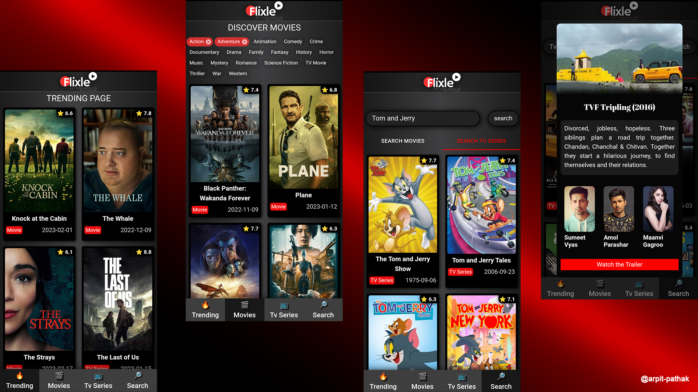

# 🔰 Flixle App 🔰

### 👉 Get Your Movie Fix with Flixle

Flixle is a web-based, user friendly application that helps you to discover and explore popular movies and tv shows

> Project By Arpit Pathak ✨

## 📌 **Project's Live Link 🚀 [Click here](https://flixle.netlify.app/)🔗**

## 📌💻 Tech Stack:

### 🔹FrontEnd : React Js, Material-UI, HTML CSS JavaScript

### 🔹Backend : TMDB API

## 📌 App on Multiple Screens

## 📌 Mobile View 📲

## 📌Screenshots

## 📌 Social Links 📬

---

